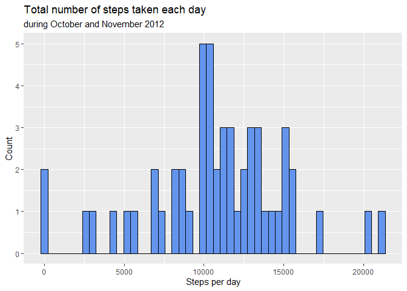
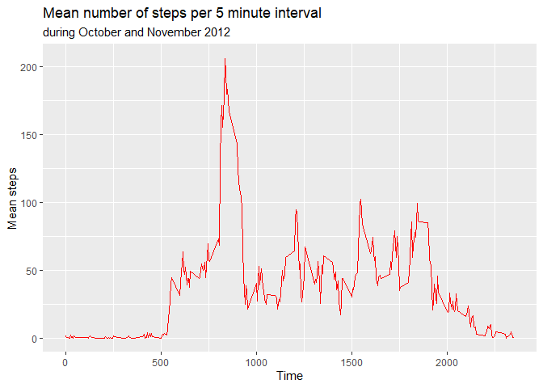
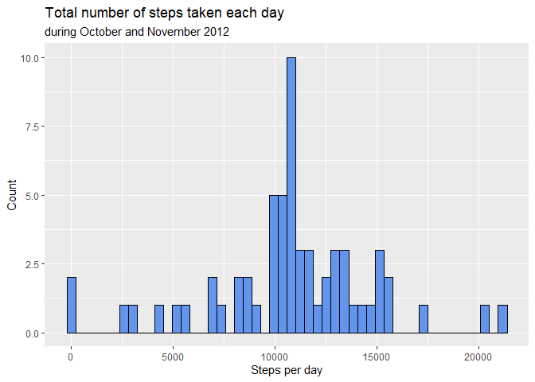
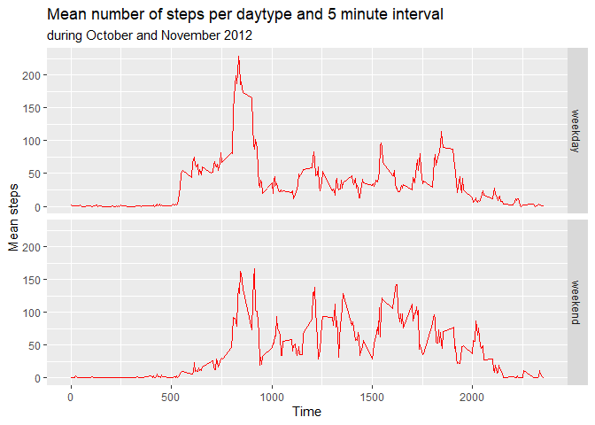

## Load required packages

```r
library(dplyr)
```

```
## 
## Attaching package: 'dplyr'
```

```
## The following objects are masked from 'package:stats':
## 
##     filter, lag
```

```
## The following objects are masked from 'package:base':
## 
##     intersect, setdiff, setequal, union
```

```r
library(ggplot2)
library(stringr)
```


```r
# Set the system language to english (optional)
Sys.setenv(LANGUAGE="en")
```


## Loading and preprocessing the data

### 1. Load the data

```r
unzip("activity.zip")
act_data <- read.csv("activity.csv")
```

### 2. Preprocess the data

```r
act_data <- act_data %>% 
        mutate(date = as.Date(date)) %>%
        mutate(interval = str_pad(as.character(act_data$interval), 4, pad = "0"))
```


## What is mean total number of steps taken per day?

### 1. Make a histogram of total number of steps taken each day


```r
# Computation of daily steps totals
daily_steps <- act_data %>%
        group_by(date) %>%
        summarise(total_steps = sum(steps))
```


```r
# Plot the histogram with ggplot
daily_steps %>%
        ggplot() +
        aes(x = total_steps) +
        geom_histogram(bins = 50, 
                       color = "black",
                       fill = "cornflowerblue",
                       na.rm = FALSE) +
        labs(title = "Total number of steps taken each day",
             subtitle = "during October and November 2012",
             x = "Steps per day",
             y = "Count") 
```

```
## Warning: Removed 8 rows containing non-finite values (stat_bin).
```

<!-- -->

### 2. Calculate and report the mean and median total number of steps taken per day


```r
# Mean
mean_steps <- as.integer(mean(daily_steps$total_steps, na.rm = TRUE))

# Median
median_steps <- as.integer(median(daily_steps$total_steps, na.rm = TRUE))
```

a. The mean of total daily steps is 10766
b. The median of total daily steps is 10765.


## What is the average daily activity pattern?

### 1. Make a time series plot (i.e. type = "l") of the 5-minute interval (x-axis)  and the average number of steps taken, averaged across all days (y-axis)


```r
# Calculate the average number of steps for each interval
act_data_interval <- act_data %>%
  mutate(interval = as.numeric(interval)) %>%
  group_by(interval) %>%
  summarise(mean.interval = mean(steps, na.rm = TRUE))

# Create time line
act_data_interval %>%
        ggplot() +
        aes(x = interval, y = mean.interval) +
        geom_line(color = "red") +
        labs(title = "Mean number of steps per 5 minute interval",
             subtitle = "during October and November 2012",
             x = "Time",
             y = "Mean steps")
```

<!-- -->

### 2. Which 5-minute interval, on average across all the days in the dataset, contains the maximum number of steps?


```r
max_interval_index <- which.max(act_data_interval$mean.interval)
max_steps_per_i <- max(act_data_interval$mean.interval)
max_timestamp_i <- act_data_interval$interval[act_data_interval$mean.interval == max_steps_per_i]
```

The interval number at minute 835 which is the interval number 104on average across all the days in the dataset, contains the maximum number of steps, which is 206.1698113. 


## Imputing missing values

### 1. Calculate and report the total number of missing values in the dataset (i.e. the total number of rows with NAs)


```r
miss_val <- sum(is.na(act_data$steps))
```

There are 2304 missing values in the dataset.

### 2. Devise a strategy for filling in all of the missing values in the dataset. The strategy does not need to be sophisticated. For example, you could use the mean/median for that day, or the mean for that 5-minute interval, etc.

Answer: Replacing all missing values with their mean number of steps for the respective interval must be appropriate. Another option would be to fill in the missing values with interpolated values of the previous and following intervall. This method was not used, as there are many missing values in consecutive intervals, but not randomly distributed over the full time span.

### 3. Create a new dataset that is equal to the original dataset but with the missing data filled in.


```r
new_act_data <- act_data

for(i in rep(1:length(new_act_data$steps))){
        if(is.na(new_act_data$steps[[i]])){
                new_act_data$steps[[i]] <- act_data_interval$mean.interval[[1 + i %% 288]]
        }
}

new_act_data$steps <- as.integer(new_act_data$steps)

new_miss_val <- sum(is.na(new_act_data$steps))
```
In the new dataset **new_act_data** there are 0 missing values remaining.


### 4. Make a histogram of the total number of steps taken each day and calculate and report the mean and median total number of steps taken per day. Do these values differ from the estimates from the first part of the assignment? What is the impact of imputing missing data on the estimates of the total daily number of steps?


```r
# Computation of daily steps totals
new_daily_steps <- new_act_data %>%
        group_by(date) %>%
        summarise(total_steps = sum(steps, na.rm = TRUE))
```

The histogram:

```r
# Plot the histogram with ggplot
new_daily_steps %>%
        ggplot() +
        aes(x = total_steps) +
        geom_histogram(bins = 50, 
                       color = "black",
                       fill = "cornflowerblue",
                       na.rm = FALSE) +
        labs(title = "Total number of steps taken each day",
             subtitle = "during October and November 2012",
             x = "Steps per day",
             y = "Count") 
```

<!-- -->

The mean and median:


```r
# mean
new_mean_steps <- as.integer(mean(new_daily_steps$total_steps))
means_diff <- new_mean_steps-mean_steps 

# median
new_median_steps <- as.integer(median(new_daily_steps$total_steps))
medians_diff <- new_median_steps-median_steps 
```

a. The mean of total daily steps is 10749
b. The median of total daily steps is 10641.

The difference between the mean of the data with replaced NAs and the original data counts -17.
The difference between the median of the data with replaced NAs and the original data counts -124.


## Are there differences in activity patterns between weekdays and weekends?

### 1. Create a new factor variable in the dataset with two levels – “weekday” and “weekend” indicating whether a given date is a weekday or weekend day.


```r
# Create the new factor variable daytype
new_act_data <- new_act_data %>%
  mutate(day = sapply(new_act_data$date, weekdays)) %>%
  mutate(daytype = ifelse(day == "Samstag" | day == "Sonntag", "weekend", "weekday")) %>%
  mutate(daytype = as.factor(daytype))
```


### 2. Make a panel plot containing a time series plot (i.e. type = "l") of the 5-minute interval (x-axis) and the average number of steps taken, averaged across all weekday days or weekend days (y-axis).


```r
# Prepare data for easy plot handling
new_act_data_interval <- new_act_data %>%
  mutate(interval = as.numeric(interval)) %>%
  group_by(interval, daytype) %>%
  summarise(mean.interval = mean(steps, na.rm = TRUE))
```

```
## `summarise()` has grouped output by 'interval'. You can override using the `.groups` argument.
```

```r
# Create time line with ggplot
new_act_data_interval %>%
  ggplot() +
  aes(x = interval, y = mean.interval) +
  geom_line(color = "red") +
  facet_grid((daytype ~ .))+
        labs(title = "Mean number of steps per daytype and 5 minute interval",
             subtitle = "during October and November 2012",
             x = "Time",
             y = "Mean steps")
```

<!-- -->

